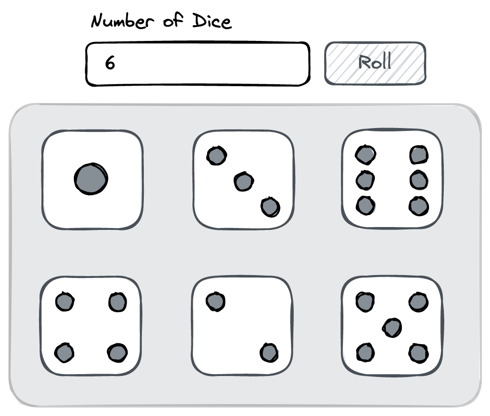

## Dice Roller

A simple app that simulates the results of rolling a specified number of 6-sided dice.

### Requirements

- The user can specify the number of dice to roll using an input field (value must be an integer between 1 and 12, inclusive).
- Upon clicking the **"Roll"** button, the dice roll is simulated, and the results are displayed.
- The results should be displayed in rows of three dice each.

