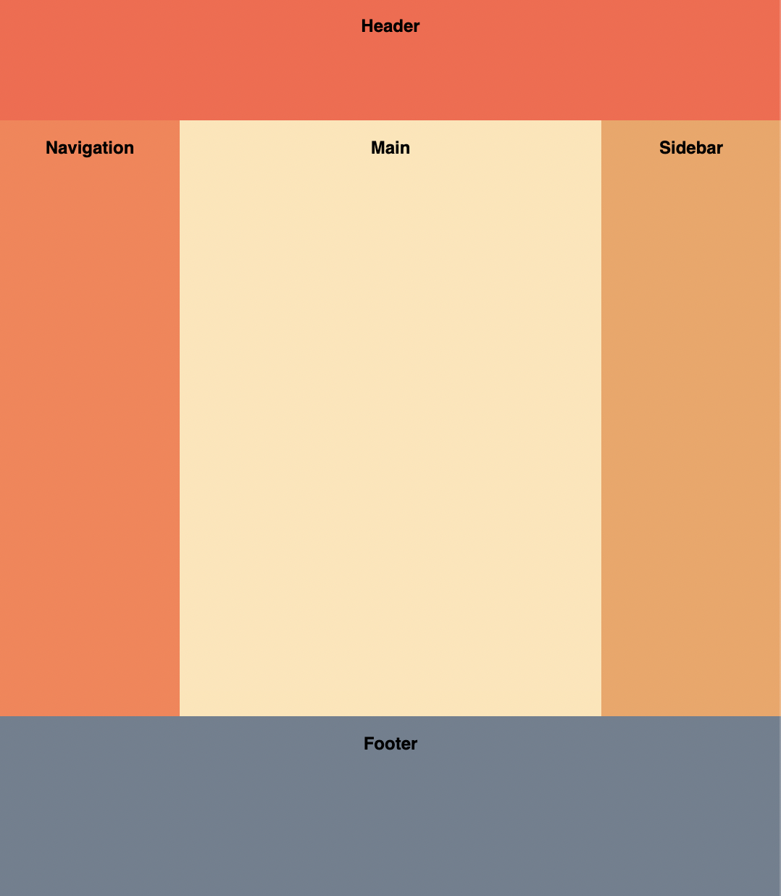

## Holy Grail

The Holy Grail layout is a famous CSS page layout that has traditionally been hard to implement. It consists of a header, footer, and three columns:

- The **left column** contains navigation items.
- The **middle column** contains the page contents.
- The **right column** contains ads.

#### Holy Grail Layout Example

Implement the Holy Grail layout using just CSS. You shouldn't need to change the HTML too much.

### Requirements

#### Header
- Stretches horizontally across the whole page.
- Height: 60px.

#### Columns
- Left and right columns: Fixed width of 100px.
- Center column: Fluid-width.
- All columns should have the same height, regardless of which column is the tallest.

#### Footer
- Stretches horizontally across the whole page.
- Height: 100px.
- The footer should be at the bottom of the page even if there is not enough content to fill up the viewport height.
